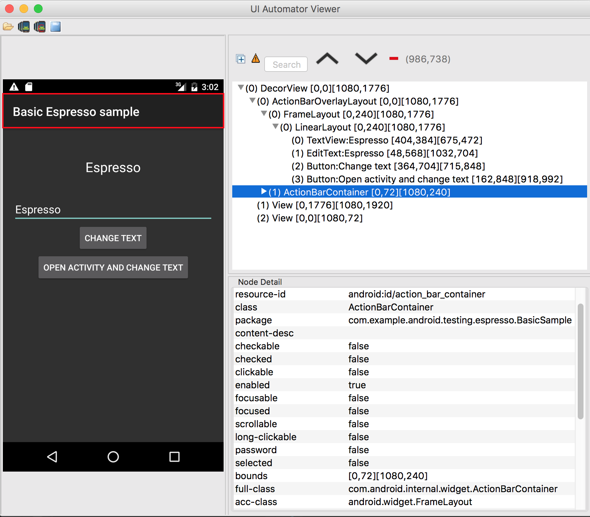

# view_to_uix

Exports Espresso view in uiautomatorviewer format.

# Use

1. Invoke [`ViewToUix.dumpView();`](https://github.com/bootstraponline/view_to_uix/blob/master/BasicSample/app/src/androidTest/java/com/example/android/testing/espresso/BasicSample/ViewToUix.java) [from your test.](https://github.com/bootstraponline/view_to_uix/blob/b87b4dd4749127c232c9a70adfe85517dc8928be/BasicSample/app/src/androidTest/java/com/example/android/testing/espresso/BasicSample/ChangeTextBehaviorTest.java#L79)
2. Download png and uix file with `adb pull /sdcard/Android/data/com.example.android.testing.espresso.BasicSample/cache/dump`
3. Open uiautomatorviewer then select [image and file](uix/)
 
4. Inspect the Espresso view hierarchy
 

# Credits

- [droiddriver](https://android.googlesource.com/platform/external/droiddriver)
- [espresso](https://android.googlesource.com/platform/frameworks/testing/+/android-support-test)
- [uiautomator](https://android.googlesource.com/platform/frameworks/uiautomator/+/android-support-test/src/main/java/android/support/test/uiautomator)
